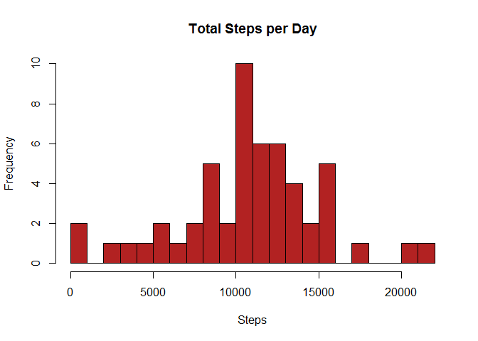
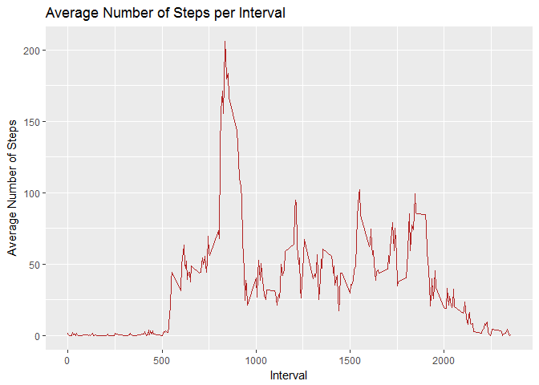
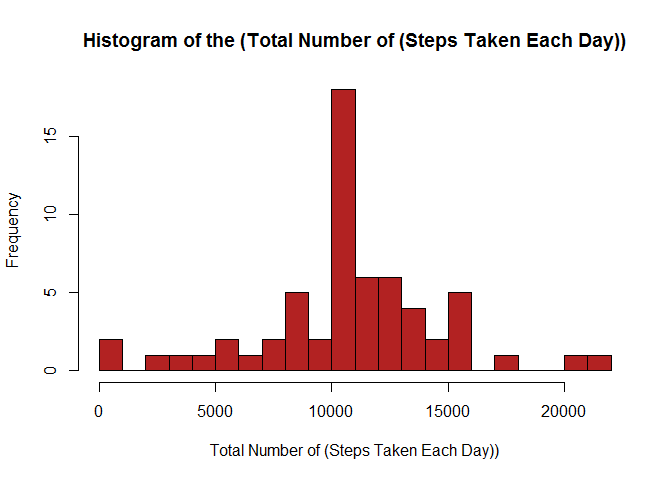
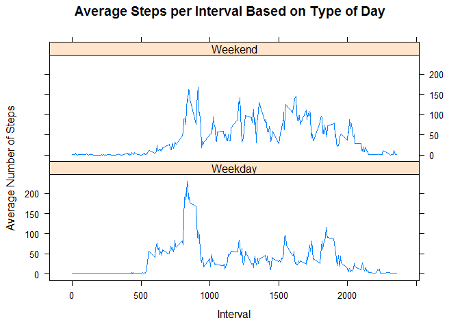

## Reproducible Research :: Course Project 1

### Introduction
It is now possible to collect a large amount of data about personal movement using activity monitoring devices such as a Fitbit, Nike Fuelband, or Jawbone Up. These type of devices are part of the "quantified self" movement - a group of enthusiasts who take measurements about themselves regularly to improve their health, to find patterns in their behavior, or because they are tech geeks. But these data remain under-utilized both because the raw data are hard to obtain and there is a lack of statistical methods and software for processing and interpreting the data.

This assignment makes use of data from a personal activity monitoring device. This device collects data at 5 minute intervals through out the day. The data consists of two months of data from an anonymous individual collected during the months of October and November, 2012 and include the number of steps taken in 5 minute intervals each day.

### Preparing R : Loading Necessary Packages


```r
library(ggplot2)
library(plyr)
```

##Loading and preprocessing the data

1. Load the data (i.e. read.csv())
2. Process/transform the data (if necessary) into a format suitable for your analysis

### Methodology

1.Reading the Dataset from working directory


```r
activity <- read.csv("activity.csv")
```

2. Processing the Data


```r
activity$day <- weekdays(as.Date(activity$date))
activity$DateTime<- as.POSIXct(activity$date, format="%Y-%m-%d")
```

## What is mean total number of steps taken per day?

1. Calculate the total number of steps taken per day
2. Make a histogram of the total number of steps taken each day
3. Calculate and report the mean and median of the total number of steps taken per day

### Methodology

1. Calculate the total number of steps taken per day

```r
## summarizing total steps per date
sumdata <- aggregate(activity$steps ~ activity$date, FUN=sum, )
colnames(sumdata)<- c("Date", "Steps")
```
2. Make a histogram of the total number of steps taken each day

```r
## Creating the historgram of total steps per day
hist(sumdata$Steps, breaks=20, xlab="Steps", main = "Total Steps per Day", col="firebrick")
```

<!-- -->


3. Calculate and report the mean and median of the total number of steps taken per day

```r
## Mean of Steps
as.integer(mean(sumdata$Steps))
```

```
## [1] 10766
```

```r
## Median of Steps
as.integer(median(sumdata$Steps))
```

```
## [1] 10765
```

## What is the average daily activity pattern?

1. Make a time series plot (i.e. type = "l") of the 5-minute interval (x-axis) and the average number of steps taken, averaged across all days (y-axis)
2. Which 5-minute interval, on average across all the days in the dataset, contains the maximum number of steps?

### Methodology

1. Calculate the average number of steps taken in each 5-minute interval per day using ddply and plot the graph using ggplot


```r
##pulling data without nas
clean <- activity[!is.na(activity$steps),]

##create average number of steps per interval
intervalTable <- ddply(clean, .(interval), summarize, AvgSteps = mean(steps))

##Create line plot of average number of steps per interval
p <- ggplot(intervalTable, aes(x=interval, y=AvgSteps), xlab = "Interval", ylab="Average Number of Steps")
p + geom_line(color = "firebrick")+xlab("Interval")+ylab("Average Number of Steps")+ggtitle("Average Number of Steps per Interval")
```

<!-- -->

2. Which 5-minute interval, on average across all the days in the dataset, contains the maximum number of steps?


```r
##Maximum steps by interval
maxSteps <- max(intervalTable$AvgSteps)
##Which interval contains the maximum average number of steps
intervalTable[intervalTable$AvgSteps==maxSteps,]
```

```
##     interval AvgSteps
## 104      835 206.1698
```


## Imputing missing values

Note that there are a number of days/intervals where there are missing values (coded as NA). The presence of missing days may introduce bias into some calculations or summaries of the data.

1. Calculate and report the total number of missing values in the dataset (i.e. the total number of rows with NAs)
2. Devise a strategy for filling in all of the missing values in the dataset. The strategy does not need to be sophisticated. For example, you could use the mean/median for that day, or the mean for that 5-minute interval, etc.
Create a new dataset that is equal to the original dataset but with the missing data filled in.
3. Make a histogram of the total number of steps taken each day and Calculate and report the mean and median total number of steps taken per day. Do these values differ from the estimates from the first part of the assignment? What is the impact of imputing missing data on the estimates of the total daily number of steps?

###Methodology

1. Calculate and report the total number of missing values in the dataset (i.e. the total number of rows with NAs)


```r
##Number of NAs in original data set
nrow(activity[is.na(activity$steps),])
```

```
## [1] 2304
```

2. We will use the approach to fill in a missing NA with the average number of steps in the same 5-min interval.


```r
activity_full <- activity
nas <- is.na(activity_full$steps)
avg_interval <- tapply(activity_full$steps, activity_full$interval, mean, na.rm=TRUE, simplify=TRUE)
activity_full$steps[nas] <- avg_interval[as.character(activity_full$interval[nas])]

sumactivity <- aggregate(activity_full$steps ~ activity_full$date, FUN=sum, )
colnames(sumactivity)<- c("Date", "Steps")
```

 
 
3.Make a histogram of the total number of steps taken each day 
 

```r
hist(
        sumactivity$Steps,
        col = "firebrick",
        main = "Histogram of the (Total Number of (Steps Taken Each Day))",
        xlab = "Total Number of (Steps Taken Each Day))",
        breaks = 20
)
```

<!-- -->

5. report the mean total number of steps taken per day.

```r
## Mean of Steps with NA data removed
as.integer(mean(sumactivity$Steps))
```

```
## [1] 10766
```

6. report the median total number of steps taken per day.


```r
## Mean of Steps with NA data removed
as.integer(median(sumactivity$Steps))
```

```
## [1] 10766
```

Mean and median values are just slightly different after imputing missing data. Due to the fact that we replaced the NA valuesin the original data with the mean for that interval.But the shape of the distribution remains same.

## Are there differences in activity patterns between weekdays and weekends?

1. Create a new factor variable in the dataset with two levels - "weekday" and "weekend" indicating whether a given date is a weekday or weekend day.
2. Make a panel plot containing a time series plot (i.e. type = "l") of the 5-minute interval (x-axis) and the average number of steps taken, averaged across all weekday days or weekend days (y-axis). See the README file in the GitHub repository to see an example of what this plot should look like using simulated data.

### Methodology

1. Create a new factor variable in the dataset with two levels - "weekday" and "weekend" indicating whether a given date is a weekday or weekend day.


```r
## Create new column based on the days of the week
activity_full$DayCategory <- ifelse(activity_full$day %in% c("Saturday", "Sunday"), "Weekend", "Weekday")
```

2. Make a panel plot containing a time series plot (i.e. type = "l") of the 5-minute interval (x-axis) and the average number of steps taken, averaged across all weekday days or weekend days (y-axis).


```r
library(lattice) 
## Aggregate data by interval and type of day
intervalTable2 <- ddply(activity_full, .(interval, DayCategory), summarize, Avg = mean(steps))

##Plot data in a panel plot
xyplot(Avg~interval|DayCategory, data=intervalTable2, type="l",  layout = c(1,2),
       main="Average Steps per Interval Based on Type of Day", 
       ylab="Average Number of Steps", xlab="Interval")
```

<!-- -->

The step activity trends are different between weekdays and weekends. During weekend people seems to be more active compared to weekdays may be due to opportunity of more activity beyond normal working hours during weekdays.

